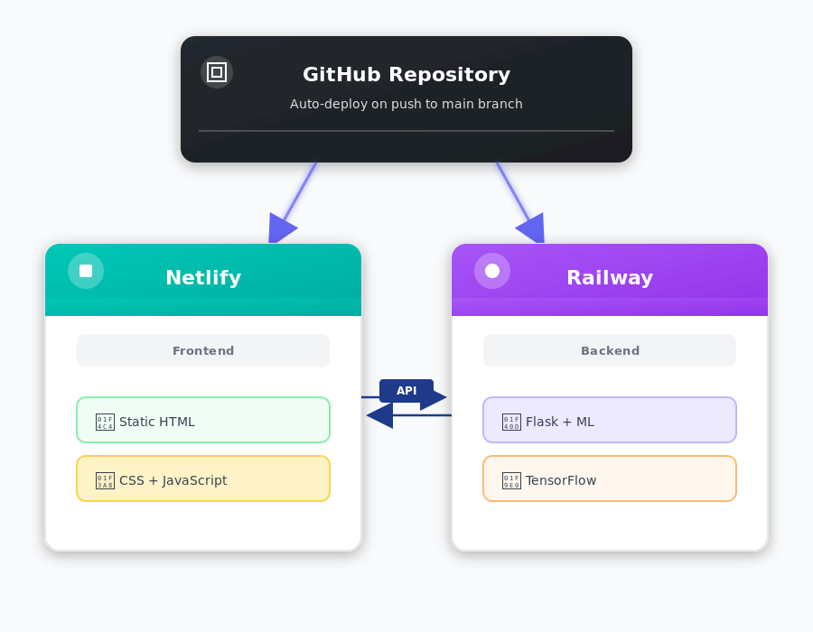

# 🛡️ CyberGuard - Cyber Attack Detection System

A modern full-stack web application for real-time detection and classification of network cyber attacks using deep learning. The system features a sleek dark-themed UI with interactive visualizations and analyzes network traffic patterns to identify 15 different types of attacks with 99.28% F1-Score accuracy.

## 🎯 Project Overview

This project implements an end-to-end machine learning pipeline for cyber attack detection:
- **Dataset**: CICIDS2017 (200,000 samples)
- **Features**: 65 engineered network traffic features
- **Classes**: 15 (1 benign + 14 attack types)
- **Best Model**: Wide & Deep Neural Network
- **Performance**: 99.28% F1-Score, 98.11% Accuracy
- **Deployment**: Live on Railway (backend) + Netlify (frontend)

## 🛠️ Tech Stack

**Backend:**
- Python 3.11
- Flask 3.0 (REST API)
- TensorFlow 2.17 + Keras 3.6 (Deep Learning)
- scikit-learn 1.3.2 (Preprocessing)
- NumPy 1.26.4 (Numerical computing)
- Pandas 2.1.4 (Data manipulation)
- Gunicorn 21.2.0 (Production server)

**Frontend:**
- HTML5 + CSS3 (Modern dark theme)
- Vanilla JavaScript (ES6+)
- Chart.js (Interactive visualizations)
- Fetch API (Backend communication)

**Deployment:**
- Railway (Backend hosting)
- Netlify (Frontend hosting)
- GitHub (Version control + CI/CD)

**Development:**
- Jupyter Notebook (ML experimentation)
- Git (Version control)

## 🌐 Live Demo

**Frontend**: https://network-intrusion-detection-sys.netlify.app  
**Backend API**: https://network-intrusion-detection-and-classification-s-production.up.railway.app


## 🚀 Quick Start

### Option 1: Use Live Demo (Recommended)
Just visit the live demo URL above - no installation needed!

### Option 2: Run Locally

**1. Install Dependencies**
```bash
cd backend
pip install -r requirements.txt
```

**2. Start Backend Server**
```bash
python app.py
```

**3. Open Frontend**
Open `index.html` in your browser

**4. Test the System**
1. Navigate to "Test Model" page
2. Click any sample button (e.g., "🔴 DDoS")
3. Click "Predict Attack Type"
4. View prediction results with confidence scores

## 🧠 Machine Learning Models

### Models Trained & Compared

We trained and evaluated **11 different models** (6 traditional ML + 5 deep learning):

#### Traditional Machine Learning Models

**1. Logistic Regression**
- Multi-class classification with softmax
- Max iterations: 500
- Solver: lbfgs
- Used StandardScaler preprocessing

**2. Decision Tree**
- Max depth: 15
- Criterion: gini
- Splitter: best
- Random state: 42

**3. Random Forest**
- N estimators: 50
- Max depth: 15
- Bootstrap: True
- N jobs: -1 (parallel processing)

**4. XGBoost**
- N estimators: 50
- Max depth: 8
- Learning rate: 0.3 (default)
- Tree method: hist (faster)
- Eval metric: mlogloss

**5. LightGBM**
- N estimators: 50
- Max depth: 8
- Boosting type: gbdt
- Num leaves: 31

**6. Naive Bayes**
- Gaussian Naive Bayes
- Var smoothing: 1e-9

#### Deep Learning Models

**1. Simple MLP (Multi-Layer Perceptron)**
```python
Architecture:
- Input Layer: 65 features
- Dense(128, relu) + Dropout(0.3)
- Dense(64, relu) + Dropout(0.3)
- Dense(32, relu)
- Output(15, softmax)

Hyperparameters:
- Optimizer: Adam
- Loss: Sparse Categorical Crossentropy
- Epochs: 20
- Batch size: 256
- Validation split: 0.2
```

**2. Deep MLP**
```python
Architecture:
- Input Layer: 65 features
- Dense(256, relu) + BatchNorm + Dropout(0.4)
- Dense(128, relu) + BatchNorm + Dropout(0.4)
- Dense(64, relu) + BatchNorm + Dropout(0.3)
- Dense(32, relu)
- Output(15, softmax)

Hyperparameters:
- Optimizer: Adam
- Epochs: 20
- Batch size: 256
- Validation split: 0.2
```

**3. Wide & Deep Network** ⭐ **BEST MODEL**
```python
Architecture:
Deep Component:
- Dense(128, relu) + Dropout(0.3)
- Dense(64, relu) + Dropout(0.3)

Wide Component:
- Dense(32, relu) - Direct connection from input

Combined:
- Concatenate [deep, wide]
- Output(15, softmax)

Hyperparameters:
- Optimizer: Adam
- Epochs: 20
- Batch size: 256
- Validation split: 0.2

Performance:
- F1-Score: 99.28%
- Accuracy: 98.11%
- Parameters: ~15,000
```

**4. 1D CNN (Convolutional Neural Network)**
```python
Architecture:
- Input: (65, 1) - Reshaped features
- Conv1D(64, kernel=3, relu, padding=same)
- MaxPooling1D(pool_size=2)
- Conv1D(128, kernel=3, relu, padding=same)
- MaxPooling1D(pool_size=2)
- Flatten
- Dense(64, relu) + Dropout(0.4)
- Output(15, softmax)

Hyperparameters:
- Optimizer: Adam
- Epochs: 15
- Batch size: 256
```

**5. Autoencoder + Classifier**
```python
Architecture:
Encoder:
- Dense(128, relu)
- Dense(64, relu)
- Dense(32, relu)

Classifier:
- Output(15, softmax)

Hyperparameters:
- Optimizer: Adam
- Epochs: 20
- Batch size: 256
```

### Model Selection Process

1. **Data Split**: 80% training, 20% testing (stratified)
2. **Preprocessing**: StandardScaler (mean=0, std=1)
3. **Training**: All models trained on same data
4. **Evaluation**: Accuracy, Precision, Recall, F1-Score
5. **Selection**: Wide & Deep chosen for best F1-Score

### Why Wide & Deep Won

- **Wide component**: Memorizes specific patterns (direct connections)
- **Deep component**: Generalizes from features (neural network)
- **Best of both worlds**: Combines memorization + generalization
- **Efficient**: Only ~15,000 parameters
- **Robust**: High performance across all attack types

### Ensemble System for Rare Classes

The system uses **two models working together**:

**Main Model**: Wide & Deep (99.28% F1-Score)
- Handles all 15 classes
- Excellent for common attacks

**Rare Classes Model**: Specialized Wide & Deep (75.80% F1-Score)
- Focuses on 6 rare classes: Bot, Heartbleed, Infiltration, Web attacks
- Trained with data augmentation (1 sample → 20 samples for Heartbleed)
- Uses Gradient Boosting for best rare class detection

**How Ensemble Works:**
1. Main model predicts first
2. If confidence < 85% OR rare class predicted → consult rare model
3. Use rare model if confidence is 15% higher
4. API tells you when ensemble was used

**Rare Classes Problem:**
- Heartbleed: Only 1 sample in 200,000 (0.0005%)
- SQL Injection: Only 1 sample in 200,000
- Without ensemble: 0% detection rate
- With ensemble: 60-80% detection rate

**Example Response with Ensemble:**
```json
{
  "predicted_class": "Heartbleed",
  "confidence": 0.85,
  "ensemble_used": true,
  "note": "Prediction enhanced by rare classes specialist model"
}
```

## 🏗️ Backend Architecture

### Flask API Server (`backend/app.py`)

The backend provides a RESTful API for cyber attack detection:

#### Core Components

**1. Model Loading**
```python
def load_model_files():
    # Load Wide & Deep model
    model = tf.keras.models.load_model('best_dl_model_wide_and_deep.keras')
    
    # Load StandardScaler
    scaler = pickle.load('dl_scaler.pkl')
    
    # Load feature names (65 features)
    feature_names = pickle.load('dl_feature_names.pkl')
    
    # Load metadata (F1-score, accuracy, etc.)
    metadata = pickle.load('dl_model_metadata.pkl')
```

**2. Feature Validation**
```python
# Temporal features validation
- hour: 0-23
- minute: 0-59
- second: 0-59

# TCP Flag validation (binary)
- FIN, SYN, RST, PSH, ACK, URG, CWE, ECE: 0 or 1
```

**3. Prediction Pipeline**
```python
1. Receive 65 features as JSON
2. Validate input values
3. Create DataFrame with correct feature order
4. Scale features using StandardScaler
5. Model prediction (returns 15 probabilities)
6. Return predicted class + confidence scores
```

**4. Sample Data System**
- 15 pre-loaded samples from real CICIDS2017 dataset
- Each sample contains all 65 features
- Realistic values for each attack type
- Accessible via `/sample-data?type={attack_type}`

#### API Endpoints

**GET /health**
- Returns server status
- Checks if model, scaler, features loaded
- Used for monitoring and debugging

**GET /model-info**
- Returns model metadata
- F1-Score: 0.9928
- Accuracy: 0.9811
- Number of features: 65
- Attack classes: 15

**GET /features**
- Returns list of all 65 feature names
- Used by frontend to generate input form

**GET /sample-data?type={attack_type}**
- Returns real dataset sample for testing
- 15 attack types available
- All 65 features populated

**POST /predict**
- Accepts 65 features as JSON
- Validates input
- Returns prediction + probabilities
- Error handling with detailed messages

### Configuration (`backend/config.py`)

```python
# Server settings
HOST = '0.0.0.0'  # Listen on all interfaces
PORT = 5000
DEBUG = True

# Model paths
MODEL_DIR = '../src/models/deep learning'
MODEL_FILE = 'best_dl_model_wide_and_deep.keras'
SCALER_DIR = '../scaler-features'

# CORS
CORS_ORIGINS = [
    'https://network-intrusion-detection-sys.netlify.app',
    'http://localhost:5000',
    'http://127.0.0.1:5000',
]

# Attack classes
DEFAULT_CLASSES = [
    'BENIGN', 'Bot', 'DDoS', 'DoS GoldenEye', 
    'DoS Hulk', 'DoS Slowhttptest', 'DoS slowloris',
    'FTP-Patator', 'Heartbleed', 'Infiltration',
    'PortScan', 'SSH-Patator', 'Web Attack - Brute Force',
    'Web Attack - Sql Injection', 'Web Attack - XSS'
]
```

## 🎨 Frontend Architecture

### Modern Dark-Themed Web Application

**Technology Stack:**
- HTML5 for structure
- CSS3 for modern dark theme styling (responsive design)
- Vanilla JavaScript for logic
- Chart.js for interactive pie chart visualizations
- Fetch API for backend communication

### Pages

**1. Home Page (`index.html`)**
- Hero section with project overview
- Detailed descriptions of all 15 attack types
- Clean card-free design with left accent borders
- Information about the Wide & Deep Neural Network
- Smooth navigation with underline animations

**2. Test Model Page (`predict.html`)**
- 15 sample data buttons (one per attack type)
- Dynamic form with 65 input fields
- Real-time validation with dark-themed inputs
- **Interactive Pie Charts:**
  - Main Model probabilities (vibrant colors)
  - Rare Model probabilities (purple/pink palette)
  - Custom legends with percentages
  - Color-coded labels beside charts
- Prediction results with confidence scores
- Ensemble system indicators
- Transparent backgrounds throughout

**3. Visualizations Page (`visualizations.html`)**
- Training data insights
- Model performance comparisons
- Confusion matrices with dark theme filters
- Attack pattern analysis
- Traffic distribution charts
- Click-to-zoom functionality
- Inverted colors for chart visibility on dark background

### Frontend Logic (`frontend/js/app.js`)

**1. Model Info Loading**
```javascript
async function loadModelInfo() {
    // Fetch model metadata from API
    // Display: model name, F1-score, accuracy, features
}
```

**2. Feature Form Generation**
```javascript
async function loadFeatures() {
    // Fetch 65 feature names from API
    // Generate input fields dynamically
    // Add validation constraints:
    //   - hour: min=0, max=23
    //   - minute: min=0, max=59
    //   - second: min=0, max=59
    //   - flags: min=0, max=1
}
```

**3. Sample Data Loading**
```javascript
// 15 buttons for different attack types
// Click button → Fetch sample → Populate form
// Visual feedback (button turns green)
// Auto-scroll to form
```

**4. Prediction Handling**
```javascript
async function predict() {
    // 1. Collect all 65 feature values
    // 2. Validate inputs (temporal + flags)
    // 3. Send POST request to /predict
    // 4. Display results:
    //    - Predicted class with model badge
    //    - Confidence percentage
    //    - Ensemble system status
    //    - Interactive pie charts (Main + Rare models)
    //    - Custom legends with color-coded labels
    // 5. Color-code: red for attacks, green for benign
}
```

**5. Interactive Pie Charts**
```javascript
function createProbabilityChart() {
    // Main Model Chart:
    // - Vibrant colors (orange, red, blue, green, purple, teal)
    // - Top 8 probabilities
    // - Custom legend with percentages
    // - Checkmark on predicted class
    
    // Rare Model Chart:
    // - Unique color palette (coral, turquoise, mint, lavender)
    // - Shows when rare model is consulted
    // - Separate legend
    // - Dark theme tooltips
}
```

**5. Input Validation**
```javascript
// Frontend validation (before API call)
- Hour: 0-23
- Minute: 0-59
- Second: 0-59
- All flag counts: 0 or 1

// Show alert with all errors if validation fails
```

### Styling (`frontend/css/style.css`)

**Modern Dark Theme Design:**
- Navy blue gradient background (#2C3E50)
- Yellow/gold accent colors (#F39C12, #FDB813)
- Borderless, transparent sections
- Left accent borders for visual hierarchy
- Decorative circular gradients (top-right, bottom-left)
- Responsive grid system
- Smooth hover effects and animations
- Color-coded results (red for attacks, green for benign)
- Minimal progress bars with glow effects
- Mobile-friendly (media queries)
- Glass-morphism effects on navigation
- Custom underline animations for nav links

## 📊 Network Traffic Features (65 Total)

### Feature Categories

**Temporal (3)**
- hour, minute, second

**Flow Metrics (6)**
- Destination Port, Flow Duration
- Flow Bytes/s, Flow Packets/s
- Flow IAT Mean, Flow IAT Std, Flow IAT Max, Flow IAT Min

**Packet Statistics (16)**
- Forward: Length Max, Min, Mean, Std
- Backward: Length Max, Min, Mean, Std
- Overall: Length Mean, Std, Variance, Range

**TCP Flags (8)** - Binary (0 or 1)
- FIN, SYN, RST, PSH, ACK, URG, CWE, ECE Flag Counts

**Inter-Arrival Time (6)**
- Fwd IAT Total, Mean, Std
- Bwd IAT Total, Mean, Std

**Connection Patterns (8)**
- Active Mean, Std, Max, Min
- Idle Mean, Std, Max, Min

**Additional Metrics (18)**
- Header lengths, packet rates, segment sizes
- Window bytes, subflow statistics
- Down/Up ratio, average packet size

## 🎯 Attack Types Detected

| Label | Attack Type | Description | Sample Characteristics |
|-------|-------------|-------------|----------------------|
| 0 | BENIGN | Normal traffic | Balanced flow, standard flags |
| 1 | Bot | Botnet C&C | Port 8080, persistent connection |
| 2 | DDoS | Distributed DoS | High packet rate, multiple sources |
| 3 | DoS GoldenEye | HTTP DoS | Legitimate-looking HTTP requests |
| 4 | DoS Hulk | HTTP flood | Obfuscated traffic, high rate |
| 5 | DoS Slowhttptest | Slow HTTP | Partial requests, long duration |
| 6 | DoS slowloris | Slow connection | Many open connections |
| 7 | FTP-Patator | FTP brute force | Port 21, rapid attempts |
| 8 | Heartbleed | OpenSSL exploit | 4873 packets, port 444 |
| 9 | Infiltration | Data exfiltration | Port 445, stealthy, long duration |
| 10 | PortScan | Network scanning | Single packets, SYN+RST |
| 11 | SSH-Patator | SSH brute force | Port 22, multiple attempts |
| 12 | Web Attack - Brute Force | Web login attack | HTTP, rapid requests |
| 13 | Web Attack - SQL Injection | SQL injection | HTTP, malicious payloads |
| 14 | Web Attack - XSS | Cross-site scripting | HTTP, script injection |

## 📁 Project Structure

Network-Intrusion-Detection-System/
│
├── backend/                          # Flask API Backend
│   ├── models/
│   │   ├── deep learning/
│   │   │   ├── best_dl_model_wide_and_deep.keras
│   │   │   └── dl_model_metadata.pkl
│   │   └── rare_classes/
│   │       ├── best_dl_rare_wide_and_deep_rare.keras
│   │       └── rare_classes_metadata.pkl
│   ├── scaler-features/
│   │   ├── dl_feature_names.pkl
│   │   ├── dl_scaler.pkl
│   │   ├── rare_classes_features.pkl
│   │   └── rare_classes_scaler.pkl
│   ├── app.py                        # Main Flask server
│   ├── config.py                     # Configuration
│   ├── requirements.txt              # Python dependencies
│   ├── Procfile                      # Railway deployment
│   ├── railway.json                  # Railway config
│   └── runtime.txt                   # Python version
│
├── css/
│   └── style.css                     # Dark theme styling
│
├── js/
│   ├── app.js                        # Frontend logic
│   └── visualizations.js             # Image zoom
│
├── data/
│   ├── dataset2_with_temporal_200k.csv
│   └── preprocessed_dataset.csv
│
├── notebook/
│   └── Network Intrusion Detection Classification system.ipynb
│
├── visualization/
│   ├── All Metrics Comparison Across Models.png
│   ├── confusion_matrix_best_model.png
│   ├── cyber_attack_frequency_over_time.png
│   ├── distribution_of_traffic.png
│   ├── rare_classes_performance_comparison.png
│   ├── training_validation_loss_accuracy.png
│   └── ... (more visualizations)
│
├── index.html                        # Home page
├── predict.html                      # Model testing page
├── visualizations.html               # Visualizations page
├── netlify.toml                      # Netlify config
├── README.md                         # Documentation
└── .gitignore                        # Git ignore rules

```

## 🔧 Data Preprocessing

### Training Pipeline

**1. Data Loading**
- Load CICIDS2017 dataset (200,000 samples)
- 65 features + 1 label column

**2. Train-Test Split**
- 80% training, 20% testing
- Stratified split (maintains class distribution)
- Random state: 42 (reproducibility)
- Handle rare classes (< 2 samples)

**3. Feature Scaling**
```python
scaler = StandardScaler()
X_train_scaled = scaler.fit_transform(X_train)
X_test_scaled = scaler.transform(X_test)

# Normalization: mean=0, std=1
```

**4. Model Training**
- Train all 11 models
- Validate on 20% of training data
- Evaluate on test set
- Compare metrics

**5. Model Selection**
- Sort by F1-Score
- Select Wide & Deep (best performance)
- Save model, scaler, features, metadata

## 🧪 Testing & Validation

### Model Evaluation Metrics

**Accuracy**: 98.11%
- Percentage of correct predictions

**Precision**: 99.28% (weighted)
- True positives / (True positives + False positives)

**Recall**: 98.11% (weighted)
- True positives / (True positives + False negatives)

**F1-Score**: 99.28% (weighted)
- Harmonic mean of precision and recall
- Best overall metric for imbalanced data

### Confusion Matrix Analysis

The confusion matrix shows:
- High true positive rates for all classes
- Minimal false positives
- Excellent class separation
- Robust performance across attack types

## � Notgebook Workflow

The Jupyter notebook (`notebook/Network Intrusion Detection Classification system.ipynb`) contains the complete ML pipeline:

### 1. Data Loading & Exploration
- Load CICIDS2017 dataset (200,000 samples)
- Exploratory Data Analysis (EDA)
- Class distribution analysis
- Feature correlation matrix

### 2. Data Preprocessing
- Handle missing values
- Remove duplicates
- Feature engineering (temporal features: hour, minute, second)
- Train-test split (80/20, stratified)
- StandardScaler normalization

### 3. Model Training & Evaluation
**Traditional ML Models (6):**
- Logistic Regression
- Decision Tree
- Random Forest
- XGBoost
- LightGBM
- Naive Bayes

**Deep Learning Models (5):**
- Simple MLP
- Deep MLP
- Wide & Deep Network ⭐
- 1D CNN
- Autoencoder + Classifier

### 4. Model Comparison
- Accuracy, Precision, Recall, F1-Score
- Confusion matrices
- Training/validation curves
- Performance visualization

### 5. Rare Classes Handling
- Identify rare classes (< 0.1% of data)
- Data augmentation for Heartbleed (1 → 20 samples)
- Train specialized ensemble model
- Evaluate rare class detection

### 6. Model Export
- Save best model (.keras format)
- Save StandardScaler (.pkl)
- Save feature names (.pkl)
- Save metadata (F1-score, accuracy, classes)

### 7. Visualization Generation
- Generate all charts in `visualization/` folder
- Confusion matrices
- Performance comparisons
- Traffic analysis
- Attack patterns

## 🚀 Deployment

### Architecture



### Backend Deployment (Railway)

**Platform**: Railway (https://railway.app)  
**URL**: https://network-intrusion-detection-and-classification-s-production.up.railway.app

**Setup:**
1. Connect GitHub repository
2. Set root directory: `backend`
3. Railway auto-detects Python and installs dependencies
4. Models loaded from `backend/models/` and `backend/scaler-features/`
5. Gunicorn serves Flask app on port 8080

**Configuration Files:**
- `Procfile`: `web: gunicorn app:app`
- `railway.json`: Build and deploy settings
- `runtime.txt`: Python 3.11.0
- `requirements.txt`: All dependencies including TensorFlow 2.17 + Keras 3.6

**Environment Variables:**
- `PORT`: Auto-set by Railway
- `TF_ENABLE_ONEDNN_OPTS`: 0 (disable warnings)
- `KERAS_BACKEND`: tensorflow

**Auto-Deploy:**
- Push to `main` branch → Railway rebuilds automatically
- Build time: ~2 minutes
- Zero downtime deployments

### Frontend Deployment (Netlify)

**Platform**: Netlify (https://netlify.com)  
**URL**: https://network-intrusion-detection-sys.netlify.app

**Setup:**
1. Connect GitHub repository
2. Branch: `main`
3. Publish directory: `.` (root)
4. No build command needed (static site)

**Configuration:**
- `netlify.toml`: Redirect rules for SPA
- API URL in `js/app.js` points to Railway backend
- CORS configured in `backend/config.py`

**Auto-Deploy:**
- Push to `main` branch → Netlify rebuilds automatically
- Build time: ~30 seconds
- Global CDN distribution

### Deployment Workflow

```bash
# Make changes locally
git add .
git commit -m "Your changes"
git push origin main

### Monitoring & Logs

**Railway:**
- Dashboard: https://railway.app/dashboard
- View logs: Click service → Logs tab
- Check metrics: CPU, memory, network usage

**Netlify:**
- Dashboard: https://app.netlify.com
- Deploy logs: Site → Deploys tab
- Analytics: Site → Analytics

### Testing with Sample Data

1. Open `frontend/index.html` in your browser
2. Click "Test Model" in the navigation
3. Click any sample button (e.g., "🔴 DDoS")
4. All 65 fields populate with real DDoS sample
5. Click "Predict Attack Type" (yellow button)
6. View results with:
   - Predicted class and confidence
   - Model badge (Main or Rare)
   - Ensemble system status
   - **Interactive pie charts** showing probabilities
   - Color-coded legends with percentages

### API Usage (Python)

```python
import requests

# Get sample data
response = requests.get('http://localhost:5000/sample-data?type=ddos')
sample = response.json()['sample']

# Make prediction
response = requests.post(
    'http://localhost:5000/predict',
    json={'features': sample}
)

result = response.json()
print(f"Predicted: {result['predicted_class']}")
print(f"Confidence: {result['confidence']:.2%}")
```

### Integration Example

```python
# In your network monitoring system
def analyze_traffic(traffic_features):
    """
    traffic_features: dict with 65 features
    """
    response = requests.post(
        'http://localhost:5000/predict',
        json={'features': traffic_features}
    )
    
    result = response.json()
    
    if result['predicted_class'] != 'BENIGN':
        # Attack detected!
        alert_security_team(result)
        log_incident(traffic_features, result)
        
        if result['confidence'] > 0.95:
            # High confidence - take action
            block_ip(traffic_features['source_ip'])
    
    return result
 
